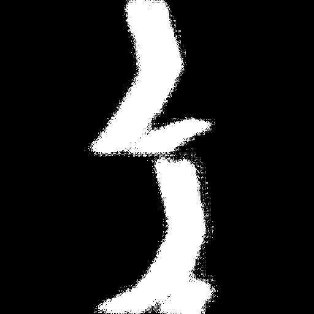

# 使用Keras实现ENet,FCN,UNet,Segnet,PSPNet等语义分割网络

使用Keras实现深度学习中的一些语义分割模型


<p align="center">
  
</p>

- LoadBatches.py 加载1个batch的原始图片和分割标签图片
- train.py 训练特定网络的模型并保存
- test.py 测试模型在新图片上得到的预测结果和单张图片前向推理需要的时间
- visualizeDataset.py 可视化ground truth标签
## 已支持的分割模型

|model_name|Base Model|Segmentation Model|
| ---|---|---|
|enet|ENet|Enet|
|fcn8|Vanilla CNN|FCN8|
|fcn32|Vanilla CNN|FCN32|
|unet|Vanilla CNN|UNet|
|mini_unet|Vanilla CNN|MiniUnet|
|segnet|Vanilla CNN|SegNet|
|pspnet|Vanilla CNN|PSPNet|
|icnet|PSPNet|ICNet|
|vgg_segnet|VGG 16|VGG_SegNet|
|vgg_unet|VGG 16|VGG_Unet|
|vgg_fcn8|VGG 16|VGG_FCN8|
|vgg_fcn32|VGG 16|VGG_FCN32|
|resnet50_fcn8|Resnet-50|ResNet50_FCN8|
|resnet50_fcn32|Resnet-50|ResNet50_FCN32|
|resnet50_segnet|Resnet-50|ResNet50_SegNet|
|resnet50_unet|Resnet-50|ResNet50_Unet|
|mobilenet_unet|MobileNet|MobileNetUnet|
|mobilenet_fcn8|MobileNet|MobileNetFCN8|
|mobilenet_fcn32|MobileNet|MobileNetFCN32|
|mobilenet_segnet|MobileNet|MobileNetSegNet|

## 依赖

- Keras 2.2.0
- Tensorflow 1.4.0

## 制作数据

使用labelme将mask画出来生成json文件之后，再把json文件通过labelme转为png图片，可以参考下这个博客：https://blog.csdn.net/u014513323/article/details/81166997

## 可视化mask标签数据

使用下面的命令可视化mask标签文件

```c++
python visualizeDataset.py --images="data/dataset1/images_prepped_train/" 
--annotations="data/dataset1/annotations_prepped_train/" --n_classes=2 
```

## 训练

使用下面的命令训练和保存模型

```c++
 python  train.py --save_weights_path=weights/ex1 \
 --train_images="data/dataset1/images_prepped_train/" \
 --train_annotations="data/dataset1/annotations_prepped_train/" \
 --val_images="data/dataset1/images_prepped_test/" \
 --val_annotations="data/dataset1/annotations_prepped_test/" \
 --n_classes=2 --input_height=512 --input_width=512 --model_name="fcn8" 
```
## 注意

ICNet这里不可用。要使用ICNet可以参考https://github.com/aitorzip/Keras-ICNet 的语义分割标签输入方式。

## 测试

```python
python test.py
```

## 分割效果

|     Input Image      | Output Segmentation Image |
| :------------------: | :-----------------------: |
|  |     |
|                      |                           |

## 需要注意的点

- 在test.py中一些参数按照我的数据写死了，训练自己的数据需要对应修改一下。


# 维护了一个微信公众号，分享论文，算法，比赛，生活，欢迎加入。

- 图片要是没加载出来直接搜GiantPandaCV 就好。


