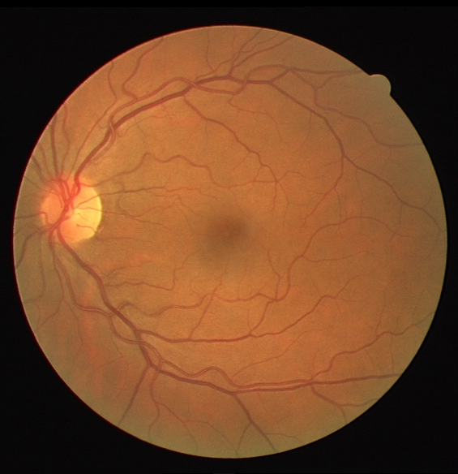

# Keras-Sematic-Segmentation


使用Keras实现深度学习中的一些语义分割模型。


# 配置
- tensorflow 1.13.0+tensorboard
- keras 2.2.4
- GTX 2080Ti
- Cuda 10.0 + Cudnn7
- opencv-python
- labelme（标注数据需要用）

# 目录结构

- data 存储输入图像和语义分割标签的文件夹
```sh
- data
	- dataset_name
		- train_image
		- train_label
		- test_image
		- test_label
```

- Models 存储使用keras实现的一些经典分割模型
- utils 存储工具代码，如数据预处理，自定义resize方式等
- losses 常见的分割损失函数如Dice Loss，Tversky Loss等
- metrics 常见的分割评价指标，比如dice分数，f1分数等
- tools 模型转换工具，将输出的Keras模型转为onnx/pb模型，再转到NCNN/TensorRT/OpenVINO等推理框架进行部署
- data.py 加载1个batch的原始图片和分割标签图片
- train.py 模型训练
- test.py 模型测试
- augmentation.py 离线数据增强
- json_to_dataset.py 批量处理多张图片并一步建好所需目录及相关mask文件

# 已支持的分割模型

|model_name|Base Model|Segmentation Model|Params|FLOPs|Model Size|Available|
|---|---|---|---|---|---|---|
|enet|ENet|Enet|371,558|759,829|1.4Mb|True|
|fcn8|Vanilla CNN|FCN8|3,609,196|7220708|29.0Mb|True|
|unet|Vanilla CNN|UNet|7,167,618|14,344,197|57.6Mb|True|
|attunet|Vanilla CNN|AttUNet|8,913,058|17,841,087|71.7Mb|True|
|r2unet|Vanilla CNN|R2UNet|17,652,930|51,065,008|141.7Mb|True|
|r2attunet|Vanilla CNN|R2AttUNet|16,958,530|46,532,640|136.2Mb|True|
|unet++|Vanilla CNN|NestedUNet|9,171,170|18,353,631|73.7Mb|True|
|segnet|Vanilla CNN|SegNet|2,941,218|5,888,377|11.9Mb|True|
|icnet|Vanilla CNN|ICNet|6,740,610|13,524,726|27.6Mb|True|
|pspnet*|Vanilla CNN|PSPNet|964,226|8,894,120|3.9Mb|True|
|mobilenet_unet|MobileNet|MobileNetUnet|407,778|825,856|1.9Mb|True|
|mobilenet_fcn8|MobileNet|MobileNetFCN8|3,432,764|6,880,358|14Mb|False|
|seunet|SENet|SEUNet|1,964,530|3,932,843|8.2Mb|True|
|scseunet|SCSENet|scSEUNet|1,959,266|3,923,359|8.1Mb|True|
|vggunet|VGGNet|VGGUnet|25,884,170|51,789,952|103.8Mb|True|
|unet_xception_resnetblock|XceptionNet|Unet_Xception_ResNetBlock|38,431,730|88,041,130|154.5Mb|True|
|deeplab_v2|DeepLab|DeepLabV2|37,799,752|75,574,697|151.3Mb|True|
|hrnet|HRNet|HRNet|28,608,672|57,356,440|117.1Mb|True|

_注：测试数据是基于输入图片大小为224x224的二分类模型。对于标*号的模型，图片大小为模型定义里支持的最小大小。_

# <a name="sec_loss"></a> 已支持的损失函数

|Name (as argument)|Type|Available|
|---|---|---|
|ce|Cross Entropy|Yes|
|weighted_ce|Weighted Categorical loss|Yes|
|b_focal|Binary Focal loss|Yes|
|c_focal|Categorical Focal loss|Yes|
|dice|Dice loss|Yes|
|bce_dice|BCE + Dice loss|Yes|
|ce_dice|CE + Dice loss|Yes|
|g_dice|Generalized Dice loss|Yes|
|jaccard|Jaccard loss|Yes|
|bce_jaccard|BCE + Jaccard loss|Yes|
|ce_jaccard|CE + Jaccard loss|Yes|
|tversky|Tversky loss|Yes|
|f_tversky|Focal Tversky loss|Yes|

_注：weighted_ce 以及 c_focal 需要指定对应class的权重或者指定class数量。默认值为平分权重的二分类。_


# 已支持的评价指标

|Type|Available|
|---|---|
|iou_score|Yes|
|jaccard_score|Yes|
|f1_score|Yes|
|f2_score|Yes|
|dice_score|Yes|

# 已支持训练可视化

为了更好的监督训练过程,我们已经提供了训练可视化,对损失函数,iou_score,dice_socoe,f1_score,f2_score等进行了可视化.在训练过程中会在模型保
存的文件夹下生成log文件夹,例如`weights/unet/log`,然后使用`tensorboard --logdir=weights/unet/log`,打开得到的网址即可获得可视化结果.

# 训练

使用下面的命令训练和保存模型，模型保存路径，训练超参数需要灵活设置。

```sh
export CUDA_VISIBLE_DEVICES=0,1 # 使用的GPU序号
python train.py ...
```

可用参数如下：
- `--exp_name` 字符串，代表此次实验的名称，默认`exp1`。
- `--dataset_name` 字符串，代表选择对应的数据集的名称，默认`bbufdataset`，支持`camvid`。
- `--loss` 字符串，代表选择的损失函数的名称，默认`ce`，全部名称见[支持的损失函数](#sec_loss)。
- `--n_classes` 整型，代表分割图像中有几种类别的像素，默认为`2`。
- `--input_height`整型，代表要分割的图像需要`resize`的长，默认为`224`。
- `--input_width` 整型，代表要分割的图像需要`resize`的宽，默认为`224`。
- `--resize_op` 整型，代表`resize`的方式，如果为`1`则为普通`resize`，如果为2，则为`letterbox_resize`，默认为`1`。
- `--validate`布尔型，代表训练过程中是否需要验证集，默认为`True`，即使用验证集。
- `--epochs`整型，代表要训练多少个`epoch`，默认为`50`。
- `--train_batch_size`整型，代表训练时批量大小，默认为`4`。
- `--val_batch_size`整型，代表训练时批量大小，默认为`4`。
- `--model_name ` 字符串类型，代表训练时使用哪个模型，支持`enet`,`unet`,`segnet`,`fcn8`等多种模型，默认为`unet`。
- `--train_save_path`字符串类型，代表训练时保存模型的路径，默认为`weights/unet`，即会将模型保存在`weights`文件夹下，并且每个模型名字前缀以`unet`开头，后面接迭代次数和准确率构成完整的保存模型的路径。
- `--resume`字符串类型，代表继续训练的时候加载的模型路径，默认值为``，即从头训练。
- `--optimizer_name`字符串类型，代表训练模型时候的优化方法，支持`sgd`,`adam`,`adadelta`等多种优化方式，默认为`adadelta`。
- `--image_init`字符串类型，代表输入图片初始化方式，支持`sub_mean`，`sub_and_divide`，`divide`，默认为`divide`。
- `--multi_gpus` 布尔类型，代表使用是否多卡进行训练，默认为Fasle，如果为True，需要手动调整`train.py`中的显卡标号，这里默认的是第`0,1`两块卡。（目前暂不支持多卡，正在开发中）


# 训练示例

- 训练本工程提供的二分类数据集：`python train.py --dataset_name bbufdataset --model_name unet --input_height 224 --input_width 224 --image_init divide --n_classes 2`
- 训练CamVid数据集：`python train.py --dataset_name camvid --model_name unet --input_height 720 --input_width 960 --image_init sub_mean --n_classes 32 --train_batch_size 2 --val_batch_size 2`


# 测试

使用下面的命令测试模型，加载模型的路径，图像输入分辨率等参数需要灵活设置。

```sh
python test.py ...
```

可用参数如下：

- `--test_images`字符串类型，代表测试图所在的文件夹路径，默认为`data/test/`。
- `--output_path`字符串类型，代表从测试图预测出的`mask`图输出路径，默认为`data/output/`。
- `--model_name` 字符串类型，代表测试时使用哪个模型，支持`enet`,`unet`,`segnet`,`fcn8`等多种模型，默认为`unet`。
- `--weights_path`字符串类型，代表预测时加载的模型权重，默认为`weights/unet.18-0.856895.hdf5`，即对应默认模型`unet`训练出来的模型权重路径。
- `--input_height`整型，代表测试集输入到网络中需要被`resize`的长，默认为`224`。
- `--input_width`整型，代表测试集输入到网络中需要被`resize`的宽，默认为`224`。
- `--resize_op` 整型，代表`resize`的方式，如果为`1`则为普通`resize`，如果为2，则为`letterbox_resize`，默认为`1`。
- `--classes`整型，代表图片中的像素类别数，默认为`2`。
- `--mIOU`布尔型，代表是否启用评测`mIOU`，默认为`False`，一旦启用需要提供带有`mask`图的测试数据集。
- `--val_images`字符串类型，代表启用`mIOU`后测试集原图的路径，默认为`data/val_image/`。
- `--val_annotations`字符串类型，代表启用`mIOU`后测试集`mask`图的路径，默认为`data/val_label/`。
- `--image_init`字符串类型，代表输入图片初始化方式，支持`sub_mean`，`sub_and_divide`，`divide`，默认为`divide`。


# 测试示例

- 测试二分类数据集：`python test.py --model_name  unet --weights_path weights/unet.xx.hdf5 --classes 2 --image_init divide`
- 测试CamVid数据集：`python test.py --model_name unet --weights_path weights/unet.xx.hdf5 --classes 32 --image_init sub_mean --input_height 720 --input_width 960`


# 数据增强

我们结合Augmentor这个库实现了一套完整的数据增强策略，即项目中的`augmentation.py`。你可以自由增加，减少各种Augmentor支持的操作。Augmentor这个数据增强库的安装方式为：`pip install Augmentor`。然后`augmentation.py`是一个独立的脚本，需要在你训练之前在本地进行增强然后将增强出来的数据拷贝到你的原始数据集中去扩充数据。它需要下面`4`个参数。

- `--train_path`  字符串类型，代表训练集的原始图片的路径，默认为`./data/images_prepped_train`。
- `--mask_path`字符串类型，代表训练集的分割标签图的路径，默认为`./data/annotations_prepped_train`。
- `--augtrain_path`字符串类型，代表增强后的图像的路径，默认为`./data/new_img`。
- `--augtrain_mask` 字符串类型，代表增强后的分割标签图的路径，默认为`./data/new_mask`。

其中`augtrain_path`和`augtrain_mask`这两个目录如果没有事先建立的话，程序会为你自动建立。执行数据增强的命令为：

```sh
python augmentation.py --train_path xxx --mask_path xxx --augtrain_path xxx --augtrain_mask xxx
```


然后，我们就会在你指定的增强路径下生成一定数量（数量也可以自己控制，程序中写死了是为每张图像生成5张增强后的图）的增强图了。这个脚本的使用手册可以看：[简易快速数据增强库使用手册](https://mp.weixin.qq.com/s/r3pGr3FD1dGDzw2zgQdK9g)


# 数据集

数据集制作使用`Labelme`即可，然后将得到的`json`文件使用`json_to_dataset.py`转换为本工程要用的`mask`标签图，具体操作步骤为：

-  使用本工程中的`json_to_dataset.py`替换掉`labelme/cli`中的相应文件—`json_to_dataset.py` 。在`cmd`中输入`python json_to_dateset.py  /path/你的json文件夹的路径`。注意是把每张图的`json`文件都放在一个目录下，`labelme`标注出来的默认是一张图片一个文件夹。
- 运行后，在`json`文件夹中会出现`mask_png、labelme_json`文件夹，`mask_png`中存放的是所有8位掩码文件！也即是本工程中使用的标签图。
- 具体来说，我们的标签图就是分别指示每张图片上每一个位置的像素属于几，`0`是背景，然后你要的类别从`1`开始往后递增即可。
- 
- 本工程训练和测试的一个2类的简单分割数据集，下载地址为：https://pan.baidu.com/s/1sVjBfmgALVK7uEjeWgIMug
- 本工程训练和测试的CamVid数据集，下载地址为：https://pan.baidu.com/s/1zequLd0aYXNseGoXn-tdog
- 本工程训练和测试的人脸部位分割数据集，下载地址为：https://pan.baidu.com/s/1uXZX9c8VFZYVP-ru5MOXXA ，提取码为：09ry 。数据集来源：https://blog.csdn.net/yuanlulu/article/details/89789807


# Model Zoo

已经训练好的Keras模型放在这个工程下，模型按照名字进行对应：

https://github.com/BBuf/Keras-Semantic-Segmentation-Model-Zoo

# 模型部署

## NCNN

## TensorRT

## OpenVINO

# 标准

## 个人制作2个类别小零件数据集分割结果


|Epoch|model_name|Base Model|Segmentation Model|Acc|iou_score|dice_score|f1_score|f2_score|
| ---|---|---|---|---|---|---|---|---|
|50|enet|ENet|Enet|||||
|50|fcn8|Vanilla CNN|FCN8|||||
|50|unet|Vanilla CNN|UNet|||||
|50|attunet|Vanilla CNN|AttUNet|||||
|50|r2unet|Vanilla CNN|R2UNet|||||
|50|r2attunet|Vanilla CNN|R2AttUNet|||||
|50|unet++|Vanilla CNN|NestedUNet|||||
|50|segnet|Vanilla CNN|SegNet|||||
|50|icnet|Vanilla CNN|ICNet|||||
|50|pspnet|Vanilla CNN|PSPNet|||||
|50|mobilenet_unet|MobileNet|MobileNetUnet|||||
|50|mobilenet_fcn8|MobileNet|MobileNetFCN8|||||
|50|seunet|SENet|SEUNet|||||
|50|scseunet|SCSENet|scSEUNet|||||
|50|vggunet|VGGNet|VGGUnet|||||
|50|unet_xception_resnetblock|XceptionNet|Unet_Xception_ResNetBlock|||||
|50|deeplab_v2|DeepLab|DeepLabV2|||||
|50|hrnet|HRNet|HRNet|||||


## CamVid分割数据集分割结果

|Epoch|model_name|Base Model|Segmentation Model|Acc|iou_score|dice_score|f1_score|f2_score|
| ---|---|---|---|---|---|---|---|---|
|50|enet|ENet|Enet|||||
|50|fcn8|Vanilla CNN|FCN8|||||
|50|unet|Vanilla CNN|UNet|||||
|50|attunet|Vanilla CNN|AttUNet|||||
|50|r2unet|Vanilla CNN|R2UNet|||||
|50|r2attunet|Vanilla CNN|R2AttUNet|||||
|50|unet++|Vanilla CNN|NestedUNet|||||
|50|segnet|Vanilla CNN|SegNet|||||
|50|icnet|Vanilla CNN|ICNet|||||
|50|pspnet|Vanilla CNN|PSPNet|||||
|50|mobilenet_unet|MobileNet|MobileNetUnet|||||
|50|mobilenet_fcn8|MobileNet|MobileNetFCN8|||||
|50|seunet|SENet|SEUNet|||||
|50|scseunet|SCSENet|scSEUNet|||||
|50|vggunet|VGGNet|VGGUnet|||||
|50|unet_xception_resnetblock|XceptionNet|Unet_Xception_ResNetBlock|||||
|50|deeplab_v2|DeepLab|DeepLabV2|||||
|50|hrnet|HRNet|HRNet|||||

## 眼球血管分割数据集

- 全部基于UNet进行测试，这个数据集是为了测试工程中支持的各种损失函数的效果。以下指标在测试集上报告。

|Epoch|Loss Name|Acc|iou_score|dice_score|f1_score|f2_score|
| ---|---|---|---|---|---|---|
|50|ce|0.9238|0.7817|0.8770|0.8770|0.8770|
|50|weighted_ce||||||
|50|b_focal||||||
|50|c_focal||||||
|50|dice||||||
|50|bce_dice||||||
|50|ce_dice||||||
|50|g_dice||||||
|50|jaccard||||||
|50|bce_jaccard||||||
|50|ce_jaccard||||||
|50|tversky||||||
|50|f_tversky||||||


## 个人制作2个类别小零件数据集分割可视化结果


|     Input Image      | Output Segmentation Image |
| :------------------: | :-----------------------: |
|  |    |


## CamVid数据集分割可视化结果


|     Input Image     | Output Segmentation Image |
| :-----------------: | :-----------------------: |
|  |  |


## 眼球病变数据集分割可视化结果

|     Input Image     | Output Segmentation Image |
| :-----------------: | :-----------------------: |
|  |  |


# 参考

- https://github.com/divamgupta/image-segmentation-keras


# 微信公众号&交流群


