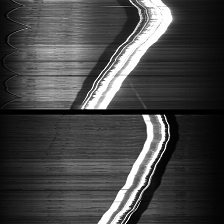
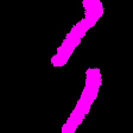

# Keras-Sematic-Segmentation

使用Keras实现深度学习中的一些语义分割模型。


# 配置
- tensorflow 1.8.0
- keras 2.1.0
- GTX 2070/CPU

# 目录结构

- data 存储输入图像和语义分割标签的文件夹
- Models 存储使用keras实现的一些经典分割模型
- data.py 加载1个batch的原始图片和分割标签图片
- train.py 模型训练
- test.py 模型测试
## 已支持的分割模型

|Epoch|model_name|Base Model|Segmentation Model|Train Acc|Available|
| ---|---|---|---|---|---|
|50|enet|ENet|Enet|0.97|True|
|50|fcn8|Vanilla CNN|FCN8|0.97|True|
|50|fcn16|Vanilla CNN|FCN8|0.97||
|50|fcn32|Vanilla CNN|FCN32|||
|50|unet|Vanilla CNN|UNet|0.99|True|
|50|segnet|Vanilla CNN|SegNet|0.99|True|
|50|pspnet|Vanilla CNN|PSPNet|||
|50|icnet|PSPNet|ICNet|||
|50|mobilenet_unet|MobileNet|MobileNetUnet|||
|50|mobilenet_fcn8|MobileNet|MobileNetFCN8|||
|50|mobilenet_fcn32|MobileNet|MobileNetFCN32|||
|50|mobilenet_segnet|MobileNet|MobileNetSegNet|||


## 训练

使用下面的命令训练和保存模型，模型保存路径，训练超参数需要灵活修改。

```python
python train.py
```

## 测试
使用下面的命令测试模型，加载模型的路径，图像输入分辨率等参数需要灵活修改。

```python
python test.py
```

## 自带数据集分割可视化结果

|     Input Image      | Output Segmentation Image |
| :------------------: | :-----------------------: |
|  |     |

## TODO
- 在大型数据集上进行测试。
- 增加letter-box resize方式。
- 数据增强策略。
- 新增tensorflow实现，使用tesor-RT部署。

# 我的微信公众号


